# Spotify Clone (iTunes Edition)

A modern, responsive Spotify-inspired music player built with React and Tailwind CSS, featuring real Bollywood music previews using the iTunes Search API.

---

## Features
- 🎵 **Real Bollywood music previews** (30s) via iTunes API
- 🎧 Modern, beautiful UI inspired by Spotify
- 🖥️ Responsive grid of music cards
- 📚 Sidebar with recently played tracks and playlists
- ⏯️ Floating, premium-style BottomBar music player
- 🔍 Search, Home, and Collection navigation
- 🌙 Dark mode look by default
- ⚡ Fast, single-page app experience

---

## Architecture

```mermaid
flowchart TD
    A[User] -->|Browses| B[Sidebar]
    A -->|Plays Song| C[Music Card Grid]
    C -->|Updates| D[BottomBar Player]
    D -->|Shows| E[Current Track Info]
    C -->|Updates| F[Recently Played in Sidebar]
    B -->|Shows| F
    A -->|Navigates| G[Navbar]
    G -->|Switches| C
    C -->|Fetches| H[iTunes API]
    H -->|Returns| C
    style B fill:#1db954,stroke:#191414,stroke-width:2px
    style C fill:#232323,stroke:#191414,stroke-width:2px
    style D fill:#282828,stroke:#191414,stroke-width:2px
    style F fill:#232323,stroke:#191414,stroke-width:2px
    style G fill:#191414,stroke:#1db954,stroke-width:2px
    style H fill:#fff,stroke:#1db954,stroke-width:2px
    style E fill:#fff,stroke:#282828,stroke-width:2px
```



---

## Screenshots

### App Preview


### UI Preview
<!-- Add your own screenshots here, e.g.:


-->

---

## Getting Started

### 1. Clone the repository
```sh
git clone https://github.com/Sameer7188/SpotifyClone_itune.git
cd SpotifyClone_itune/Spotify
```

### 2. Install dependencies
```sh
npm install
```

### 3. Start the development server
```sh
npm start
```

The app will run at [http://localhost:3000](http://localhost:3000)

---

## Deployment
You can deploy this app to Vercel, Netlify, or any static hosting that supports React apps.

---

## Credits
- UI inspired by Spotify
- Music data from [iTunes Search API](https://affiliate.itunes.apple.com/resources/documentation/itunes-store-web-service-search-api/)
- Built with React, Tailwind CSS, Redux, and react-use

---

**Enjoy your modern Spotify Clone!**
